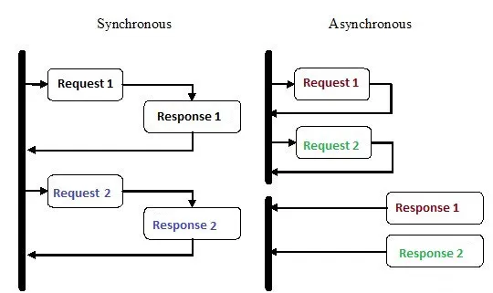

# 執行緒與協程

## 平行與併行

> “Concurrency is about dealing with lots of things at once. Parallelism is about doing lots of things at once.
>
> <mark style="color:red;">Concurrency is about structure. Parallelism is about execution</mark>.
>
> They are not the same, but related.” — Rob Pike

并行(concurrent)就是好幾個任務互相在搶相同的 CPU，搶到了就是優先執行該任務，所以在一個時間點上只有一個任務在執行；而平行(parallel)則是每個 CPU 各自負責其任務，而且是同時進行的，無所謂切換的問題。

因此以前的電腦如果是單核的話，只能做到并行，而現在的電腦大多都是多核心的所以才可以達到平行。

<figure><figcaption>
平行與并行
</figcaption></figure>

I/O bound：任務本身是透過網際網路去傳送請求，這時就會受到寫入/讀取的速度限制，任何牽涉到網路讀取和寫入，都屬於I/O bound的一種。

CPU bound：任務本身涉及大量CPU、GPU計算，比如3D製圖、AI模型訓練、本地解壓縮檔案等都屬於CPU bound的一種。

<figure><figcaption>
CPU bound與IO bound程式
</figcaption></figure>

我們運行的程式碼就是程式，當你啟動某應用程式，實際上就是讓程式生成行程(Process)並執行程式，一個程式可以開出多個行程，每條進程都有一個獨立的id(PID)，而一個行程可以開出多個執行緒(Thread)，線程即為電腦運行軟體的最小單位，是程式碼實際實行的地方，並且執行緒之間可以共享記憶體，統一由行程管理。

## 非同步程式

非同步程式設計模型可避免等待耗時操作完成所產生的效能瓶頸問題及提升程式的回應性，尤其對使用者高度互動或是 IO 密集的程式非常重要。一般不會希望使用者在應用程式中執行耗時操作時，發生整個應用程式卡住的狀況，透過非同步程式設計可以實現應用程式在處理耗時操作的同時能繼續處理其它工作。

協程是輕量化的執行緒 (Light-weight Thread)。協程屬於**協同式 (Cooperative) 多工**，而執行緒通常屬於**搶佔式 (Preemptive) 多工**。

* <mark style="color:red;">協同式多工</mark>，程式會定時放棄已佔有的執行資源讓其它程式可以執行。由程式自己讓出執行資源，作業系統不會干涉。
* <mark style="color:red;">搶佔式多工</mark>，程式有各自的優先權，作業系統會根據程式的優先權安排當下哪個程式能擁有執行資源去執行，另外作業系統有權中斷任何正在執行中的程式，變更執行資源的擁有者。

<figure><figcaption>
行程、執行緒與協程
</figcaption></figure>

## 執行緒

執行緒又叫做是輕量級的行程(light weight process)。事實上，執行緒可以想成存在行程裡面，一個行程中至少會有一個執行緒，而我們前面說行程會去執行任務，其實就是行程裡面的執行緒去做的，所以沒有行程就沒有執行緒。而當一個行程裡面有多個執行緒，就代表在一個程式中透過開啟多個執行緒的方式來完成不同的任務。而行程是作業系統分配 CPU 時間之對象單位。此外，在一個行程裡面的多個執行緒會共行進程的系統資源。

執行緒實際上是對應到底層作業系統的執行緒，因此在程式中直接使用多個執行緒實現程式並行運作，這些執行緒都會由作業系統來排程 (搶佔式多工)，當執行緒數量過多時就容易增加作業系統切換執行緒(上下文切換 Context Switch) 的負擔，影響整體效能。

<mark style="color:red;">假設你在程式中建立 N 個執行緒去並行多段程式，實際上這些執行緒能使用 CPU 的時間是作業系統決定的</mark>。

<figure><figcaption>
執行緒上下文切換
</figcaption></figure>

## 協程

協程是輕量化的執行緒。首先建立一個協程不會綁定到作業系統的執行緒，此外協程使用協同式多工來排程，協程之間的切換由當前正在執行的協程主動(由程式設計師決定)讓出執行權給其它協程執行，藉此達到並行運作，因為協程的切換是在上層，不需要由底層的作業系統來處理，所以協程交替時所產生的上下文切換負擔比執行緒小。

而協程的調度完全由用戶控制，協程也會有自己的資源(registers、context、stack)等等，並且由協程的調度器來控制說目前由哪個協程執行，哪個協程要被堵塞住。

而相對於行程及執行緒的調度，則是由 CPU 內核去進行調度，因此作業系統會有所謂許多的調度算法，並且可以進行搶占式調度，可以主動搶奪執行的控制權。反之，協程是不行的，只能進行非搶佔式的調度。

可以理解成，如協程被 block 住，則會在用戶態直接切換另外一個協程給此執行緒繼續執行，這樣其他 協程就不會被 block 住，讓資源能夠有效的被利用，藉此實現并行的概念。

<mark style="color:red;">切換開銷方面，協程遠遠低於執行緒，切換的速度也因此大幅提升</mark>。

當然協程執行時還是會被指派到一個執行緒上，因為只有執行緒才能真正從作業系統獲取到實際 CPU 執行時間。所以在協程框架下執行緒就變成一個擁有容器的執行緒 ，容器用來暫存接下來要被執行的協程。

<figure><figcaption>
協程為輕量級的執行緒
</figcaption></figure>

所建立的協程會透過函式庫或框架跟底層的執行緒去互動。所以協程是程式上的邏輯並行，實際在底層運作不一定是並行，還是需要看作業系統跟硬體的環境。

協程讓我們可以在單執行緒的情況下達到類似多執行緒的效果，相較於執行緒更小的執行單位，屬於純應用層的執行單位，作業系統並不知道有它的存在，但它和執行緒一樣有自己的記憶體空間，要注意的是協程的目的只是讓非阻塞的操作能夠被同步執行，如果程式本身是CPU bound的話那就一樣會被阻塞住。

<figure><figcaption>
協程工作切換
</figcaption></figure>

<figure><figcaption>
函數與協程執行時的切換流程
</figcaption></figure>

## 參考資料

* [https://medium.com/gogolook-tech/kotlin-coroutines-%E5%85%A5%E9%96%80%E6%A6%82%E5%BF%B5-coroutine-vs-thread-e7d112b0d8ba](https://medium.com/gogolook-tech/kotlin-coroutines-%E5%85%A5%E9%96%80%E6%A6%82%E5%BF%B5-coroutine-vs-thread-e7d112b0d8ba)
* [https://superfastpython.com/coroutines-less-memory-threads/](https://superfastpython.com/coroutines-less-memory-threads/)
