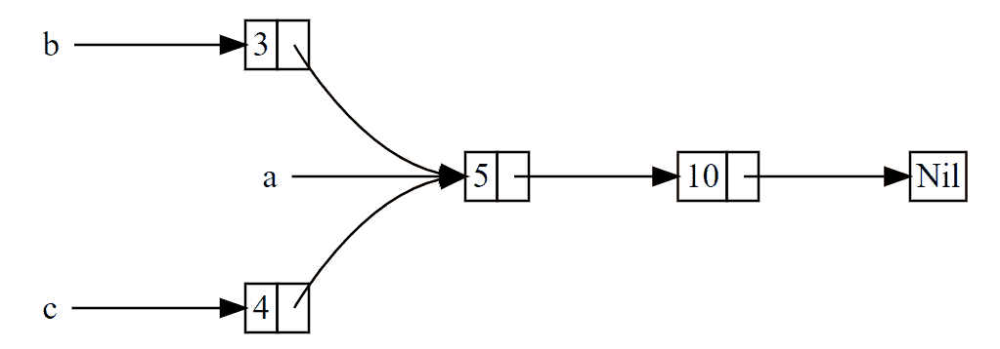

# Rc/Arc引用計數

## 簡介

為了啟用多所有權，Rust 有一個叫做 `Rc` 的類型。其名稱為 引用計數（reference counting）的縮寫。引用計數意味著記錄一個值引用的數量來知曉這個值是否仍在被使用。如果某個值有零個引用，就代表沒有任何有效引用並可以被清理。

Rust 所有權機制要求一個值只能有一個所有者，在大多數情況下都沒有問題，但是考慮以下情況：

* 在圖(graph)資料結構中，多個邊可能會擁有同一個節點，該節點直到沒有邊指向它時，才應該被釋放清理
* 在多執行緒中，多個執行緒可能會持有同一個資料，但是你受限於 Rust 的安全機制，無法同時獲取該資料的可變引用

因此通過引用計數的方式，允許一個資料資源在同一時刻擁有多個所有者。

<mark style="color:blue;">Rc 用於當我們希望在堆積上分配一些記憶體供程式的多個部分讀取，而且無法在編譯時確定程式的哪一部分會最後結束使用它的時候</mark>。如果確實知道哪部分是最後一個結束使用的話，就可以令其成為數據的所有者，正常的所有權規則就可以在編譯時生效。

注意 Rc 只能用於<mark style="color:red;">單執行緒</mark>場景；

### 不可變引用

事實上，Rc 是指向底層資料的不可變的引用，因此你無法通過它來修改資料(即你無法修改 `Rc<T>` 中的物件`T` ，只能讀取；)。這也符合 Rust 的借用規則：要麼存在多個不可變借用，要麼只能存在一個可變借用。

但是實際開發中我們往往需要對資料進行修改，這時單獨使用 Rc 無法滿足我們的需求，需要配合其它資料類型來一起使用，例如內部可變性的 RefCell 類型以及互斥鎖 Mutex。

一旦最後一個擁有者消失，則資源會自動被回收，這個生命週期是在編譯期就確定下來的。

Rc 實際上是一個指標，它不影響包裹對象的方法呼叫形式（即不存在先解開包裹再呼叫值這一說）。

## Rc (reference counting)

[https://rustwiki.org/zh-CN/std/rc/struct.Rc.html](https://rustwiki.org/zh-CN/std/rc/struct.Rc.html)

單執行緒的引用計數指標，用來共享配置在堆積上的資料。

* 內部記錄引用資料的指標數量，當最後一個 Rc 指標銷毀時，資料也隨風而去。
* <mark style="background-color:red;">因為共享，所以禁止任何改變（但可從內部可變性繞過）</mark>。如果要修改，需要配合內部可變性 RefCell 或互斥鎖 Mutex
* 可能發生迴圈引用，導致記憶體洩漏，此時須使用 Weak 弱引用。
* <mark style="color:red;">非原子操作，所以無法在執行緒間傳遞</mark>，但可用 Arc 原子引用計數指標。
* Rc 是一個智慧指標，實現了 Deref 特徵，因此你無需先解開 Rc 指標，再使用裡面的 T，而是可以直接使用 T。
* 類似 C++std::shared\_ptr。



### clone複製指標

```rust
use std::rc::Rc;
fn main() {
     let s = String::from("hello, world");
    // s在這裡被轉移給a
    // let a = Box::new(s);
    // 報錯！此處繼續嘗試將 s 轉移給 b
    // let b = Box::new(s);
    
    // 使用 Rc::new 建立了一個新的 Rc<String> 智慧指標並賦給變數 a，
    // 該指標指向底層的字串資料
    let a = Rc::new(s);
    // 這裡的 clone 僅僅複製了智慧指標並增加了引用計數，並沒有克隆底層資料
    let b = Rc::clone(&a);
    // 或者寫為  let b = a.clone();

    assert_eq!(2, Rc::strong_count(&a)); // 獲取引用計數
    assert_eq!(Rc::strong_count(&a), Rc::strong_count(&b))
}
```

### strong\_count計算引用次數

```rust
use std::rc::Rc;
fn main() {
        let a = Rc::new(String::from("test ref counting"));
        println!("count after creating a = {}", Rc::strong_count(&a)); // 1
        let b =  Rc::clone(&a);
        println!("count after creating b = {}", Rc::strong_count(&a)); // 2
        {
            let c =  Rc::clone(&a);
            println!("count after creating c = {}", Rc::strong_count(&c)); // 3
        }
        // 只有c離開scope, 因此計數減1
        println!("count after c goes out of scope = {}", Rc::strong_count(&a)); // 2
}
```

### 範例：linklist

```rust
#[derive(Debug)]
enum List {
    Cons(i32, Rc<List>),
    Nil,
}

use std::rc::Rc;
use List::{Cons, Nil};

fn main() {
    let a = Rc::new(Cons(5, Rc::new(Cons(10, Rc::new(Nil)))));
    println!("count after creating a = {}", Rc::strong_count(&a)); // 1
    let b = Cons(3, Rc::clone(&a));
    println!("count after creating b = {}", Rc::strong_count(&a)); // 2

    let c = Cons(4, Rc::clone(&a));
    println!("count after creating c = {}", Rc::strong_count(&a));// 3

    println!("{:?}", a); // Cons(5, Cons(10, Nil))
    println!("{:?}", b); // Cons(3, Cons(5, Cons(10, Nil)))
    println!("{:?}", c); // Cons(4, Cons(5, Cons(10, Nil)))
}
```

`Rc::clone` 的實現並不像大部分類型的 clone 實現那樣對所有數據進行深拷貝。`Rc::clone` 只會增加引用計數，這並不會花費多少時間。

在程式中每個引用計數變化的點，會列印出引用計數，其值可以通過調用 `Rc::strong_count` 函數獲得。這個函數叫做 strong\_count 而不是 count 是因為 Rc 也有 `weak_count`。

```rust
pub struct Rc<T: ?Sized> {
    ptr: NonNull<RcBox<T>>,
    phantom: PhantomData<T>,
}
struct RcBox<T: ?Sized> {
    strong: Cell<usize>,
    weak: Cell<usize>,
    value: T,
}
```

建立 Rc 並共享引用（複製 Rc pointer）。

```rust
use std::rc::Rc;
fn main() {
    let obj = Rc::new((1, 2, 3));
    let another_obj = Rc::clone(&obj);
    assert_eq!(obj, another_obj);
}
```

## 一個值有多個所有者的場景

考慮有下面的兩個實體: 公司(Company)和員工(Employee)。公司實體有個屬性: 經理。 有一個名為"張三"的員工實體，有兩個公司實體"分公司1"和"分公司2"，張三是這兩個公司的經理。

```rust
#[derive(Debug)]
struct Employee {
    name: String,
}

#[derive(Debug)]
struct Company {
    name: String,
    manager: Rc<Employee>,
}

use std::rc::Rc;

fn main() {
    let employee = Rc::new(Employee {
        name: String::from("張三"),
    });

    let company1 = Company {
        name: String::from("分公司1"),
        manager: employee.clone(),
    };
    let company2 = Company {
        name: String::from("分公司2"),
        manager: employee,
    };

    println!("{:?}, {:?}", company1, company2);
}
```

## 什麼時候該用 Rc

* 你需要共享一堆引用，但不確定哪個引用的生命週期會先結束。
* 你的資源不足，但需要一個 GC（Rc + RefCell = 窮人的 GC）。

## 引用循環與記憶體洩漏

Rust 的記憶體安全性保證使其難以意外地製造永遠也不會被清理的記憶體，稱為記憶體洩漏（memory leak）），但這並不是不可能。與在編譯時拒絕資料競爭不同， <mark style="color:red;">Rust 並不保證完全地避免記憶體洩漏，這意味著記憶體洩漏在 Rust 被認為是記憶體安全的</mark>。

這一點可以通過 `Rc` 和 `RefCell` 看出：創建引用循環的可能性是存在的。這會造成記憶體洩漏，因為每一項的引用計數永遠也到不了 0，其值也永遠不會被丟棄。

## 製造引用循環

這個特定的例子中，創建了引用循環之後程式立刻就結束了。這個循環的結果並不可怕。如果在更為復雜的程式中並在循環裡分配了很多記憶體並佔有很長時間，這個程式會使用多於它所需要的記憶體，並有可能壓垮系統並造成沒有記憶體可供使用。

創建引用循環並不容易，但也不是不可能。。創建引用循環是一個程式上的邏輯 bug，你應該使用自動化測試、或其他軟體開發最佳實踐來使其最小化。

另一個解決方案是重新組織資料結構，使得一部分引用擁有所有權而另一部分沒有。換句話說，循環將由一些擁有所有權的關係和一些無所有權的關係組成，只有所有權關系才能影響值是否可以被丟棄。

### 範例：Linklist兩個節點相互引用

```rust
use std::cell::RefCell;
use std::rc::Rc;
// 縮寫使用Cons與Nil
use crate::List::{Cons, Nil};

#[derive(Debug)]
// 節點
enum List {
    // RefCell<Rc<List>>表示可有多個指標持有該節點，且可以修改持有者
    Cons(i32, RefCell<Rc<List>>),
    Nil,
}

// 取得節點的下一個元素
impl List {
    fn tail(&self) -> Option<&RefCell<Rc<List>>> {
        match self {
            Cons(_, item) => Some(item),
            Nil => None,
        }
    }
}

fn main() {
    // 建立List元素a
    let a = Rc::new(Cons(5, RefCell::new(Rc::new(Nil))));

    println!("a 初始參考計數 = {}", Rc::strong_count(&a));
    println!("a 下個專案 = {:?}", a.tail());

    // 建立List元素b, 後面接a
    let b = Rc::new(Cons(10, RefCell::new(Rc::clone(&a))));

    println!("a 在 b 建立後的參考計數 = {}", Rc::strong_count(&a));
    println!("b 初始參考計數 = {}", Rc::strong_count(&b));
    println!("b 下個專案 = {:?}", b.tail());

    // 將a的下一個節點接到b，形成引用迴圈
    if let Some(link) = a.tail() {
        *link.borrow_mut() = Rc::clone(&b);
    }

    println!("b 在變更 a 後的參考計數 = {}", Rc::strong_count(&b));
    println!("a 在變更 a 後的參考計數 = {}", Rc::strong_count(&a));

    // 取消下一行的註解可以看到迴圈產生
    // 這會讓堆疊溢位
    // println!("a 下個專案 = {:?}", a.tail());
}
```

## 避免引用循環：將 Rc 變為 Weak

上面展示了呼叫 `Rc::clone` 會增加 `Rc` 實例的 `strong_count`，和只在其 `strong_count` 為 0 時才會被清理的 `Rc` 實例。

## 升級 `Weak` -> `Rc` ，與降級 `Rc` -> `Weak`

可以通過使用 Rc::downgrade 並傳遞 Rc 實例的引用來創建其值的弱引用（weak reference）。調用 Rc::downgrade 時會得到 `Weak<T>` 類型的智慧指標。不同於將 Rc 實例的 strong\_count 加1，調用 Rc::downgrade 會將 weak\_count 加1。

Rc 類型使用 weak\_count 來記錄其存在多少個 Weak 引用，類似於 strong\_count。<mark style="color:red;">其區別在於 weak\_count 無需計數為 0 就能使 Rc 實例被清理</mark>。

強引用代表如何共享 Rc 實例的所有權，<mark style="color:red;">但弱引用並不屬於所有權關係</mark>。他們不會造成引用循環，因為任何弱引用的循環會在其相關的強引用計數為 0 時被打斷。

因為 Weak 引用的值可能已經被丟棄了，<mark style="background-color:yellow;">為了使用 Weak 所指向的值，我們必須確保其值仍然有效。為此可以調用 Weak 實例的 upgrade 方法，這會返回 Option\<Rc>。如果 Rc 值還未被丟棄，則結果是 Some；如果 Rc 已被丟棄，則結果是 None</mark>。

```rust
use std::rc::Rc;
fn main() {
    let five = Rc::new(5);
    // Rc -> Weak
    let weak_five = Rc::downgrade(&five);
    println!("{}, {}", Rc::strong_count(&five), Rc::weak_count(&five));//1, 1
    // Waek -> Rc
    let strong_five: Option<Rc<_>> = weak_five.upgrade();
    assert!(strong_five.is_some());
    // Destroy all strong pointers.
    drop(strong_five);
    drop(five);
    assert!(weak_five.upgrade().is_none());
}
```

### 範例：樹狀結構指向父節點

```rust
use std::cell::RefCell;
use std::rc::{Rc, Weak};

/*
父節點必須擁有它的子節點，如果父節點釋放的話，
它的子節點也應該要被釋放。但子節點不應該擁有它的父節點，
如果我們釋放子節點的話，父節點應該要還存在。
這就是弱參考的使用時機！
*/

#[derive(Debug)]
struct Node {
    value: i32,
    // 指向父節點
    parent: RefCell<Weak<Node>>,
    // vec表示節點可以有多個分支
    children: RefCell<Vec<Rc<Node>>>,
}

fn main() {
    // 建立新節點leaf
    let leaf = Rc::new(Node {
        value: 3,
        parent: RefCell::new(Weak::new()),
        children: RefCell::new(vec![]),
    });
    // leaf 的父節點 None
    println!("leaf 的父節點 {:?}", leaf.parent.borrow().upgrade());

    // 建立分支節點
    let branch = Rc::new(Node {
        value: 5,
        parent: RefCell::new(Weak::new()),
        children: RefCell::new(vec![Rc::clone(&leaf)]),
    });

    *leaf.parent.borrow_mut() = Rc::downgrade(&branch);
    // leaf 的父節點 Some(Node { value: 5, ...}
    println!("leaf 的父節點 {:?}", leaf.parent.borrow().upgrade());
}
```


### Rc 如何管理 weak 與 strong reference

```rust
unsafe impl<#[may_dangle] T: ?Sized> Drop for Rc<T> {
    fn drop(&mut self) {
        unsafe {
            self.dec_strong();
            if self.strong() == 0 {
                // destroy the contained object
                ptr::drop_in_place(self.ptr.as_mut());
                // remove the implicit "strong weak" pointer now that we've
                // destroyed the contents.
                self.dec_weak();
                if self.weak() == 0 {
                    Global.dealloc(self.ptr.cast(), Layout::for_value(self.ptr.as_ref()));
                }
            }
        }
    }
}
```

## Arc簡介

[https://rustwiki.org/zh-CN/std/sync/struct.Arc.html](https://rustwiki.org/zh-CN/std/sync/struct.Arc.html)

Arc 是 Atomic Rc 的縮寫，顧名思義：原子化的 Rc 智慧指標。

原子化或者其它鎖雖然可以帶來的執行緒安全，但是都會伴隨著效能損耗，而且這種效能損耗還不小。因此 Rust 把這種選擇權交給你，畢竟需要執行緒安全的程式碼其實佔比並不高，大部分時候我們開發的程式都在一個執行緒內，此時使用Rc即可。

Arc 和 Rc 擁有完全一樣的 API，但Arc 和 Rc 並沒有定義在同一個模組，前者通過 use std::sync::Arc 來引入，後者通過 use std::rc::Rc。

```rust
use std::sync::Arc;
use std::thread;

fn main() {
    let s = Arc::new(String::from("mutli-thread msg"));
    let mut pool = vec![];
    for _ in 0..10 {
        let s = Arc::clone(&s);
        let handle = thread::spawn(move || println!("tid:{:?}, {}", 
            thread::current().id(), s));
        pool.push(handle);
    }

    for h in pool {
        let _ = h.join();
    }
}
```

### 參考資料

* [https://blog.frognew.com/2020/07/rust-smart-pointers-rc.html](https://blog.frognew.com/2020/07/rust-smart-pointers-rc.html)
